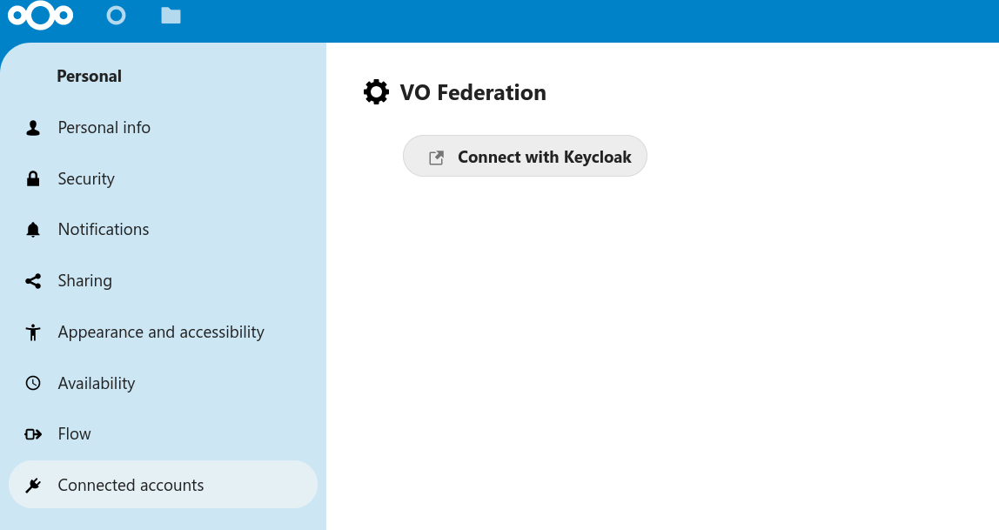
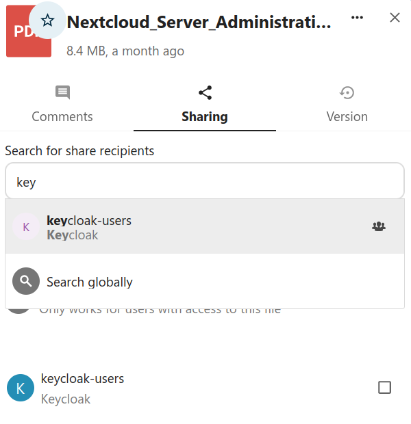

## Authentication

To share with other users of the Virtual Organisation (VO) you are part of, you need to first authenticate with the Community AAI that manages the VO membership information. After successful authentication your VO memberships appear as regular Nextcloud groups.

To connect, navigate to`/settings/user/connected-accounts` and choose any of the Community AAIs that have been configured by the server administrator. 

You will be redirected to the login page of your Community AAI. It provides identity information to Nextcloud and in particular to the VO Federation app. Please make sure that you consent to the data being shared. It should contain read access to your name and group memberships.

## Sharing

Once the connection with the Community AAI is established, you can share files and folders with members of your VO groups in Nextcloud. Please note that file access is granted to all users of the VO group and members can be registered with different Nextcloud instances.

*Image: Search and select VO share recpients or quick select from your VOs below*